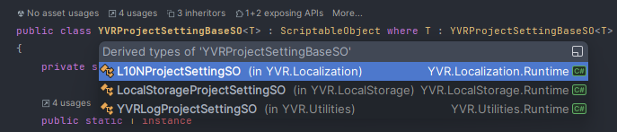
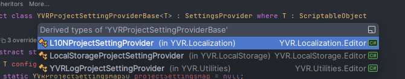

# 约定

本部分介绍各第一方模块使用 Project Settings 功能时，应当遵守的约定。

> [!Note]
> 所有 YVR Project Settings 设置与实例地址的绑定关系，定义在 `Assets/YVRProjectSettings/YVRProjectSettingsMap.asset` 中，该地址被 [YVRProjectSettingsMapSO](xref:YVR.Utilities.YVRProjectSettingsMapSO) 写死，无法修改。

1. 各继承自 `YVRProjectSettingBaseSO` 的 SO 类，应当以 `XXXProjectSettingSO` 的方式命名，并将实例存储在工程的 ``Assets/YVRProjectSettings` 的目录下
   
2. 各继承自 `YVRProjectSettingProviderBase` 的类，应当以 `XXXProjectSettingProvider` 的方式命名
   