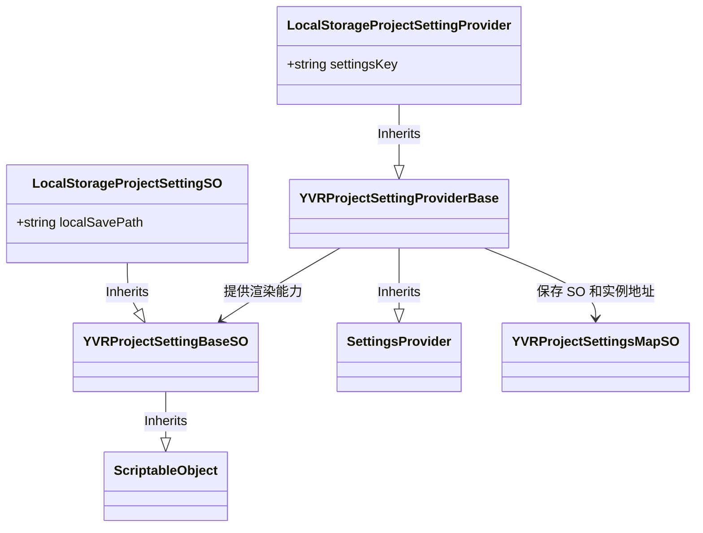

# 示例

假设需要提供关于本地存储的项目配置，可以使用 Project Settings 模块实现，对于开发者而言，需要实现两个类：
1. `LocalStorageProjectSettingSO`：管理需要设置的内容的 ScriptableObject
2. `LocalStorageProjectSettingProvider`：用以在 Project Settings 中显示 `LocalStorageProjectSettingSO` 的 Provider

两个实现的示例代码如下所示：

```csharp
[CreateAssetMenu(fileName = "YVRLocalStorageConfig", menuName = "YVR/ProjectSettings/YVRLocalStorage")]
public class LocalStorageProjectSettingSO : YVRProjectSettingBaseSO<LocalStorageProjectSettingSO>
{
    [SerializeField] public string localSavePath = "Default";
}

public class LocalStorageProjectSettingProvider : YVRProjectSettingProviderBase<LocalStorageProjectSettingSO>
{
    public override string settingsKey => "LocalStorage";

    private LocalStorageProjectSettingProvider(string path) : base(path, SettingsScope.Project) { }

    [SettingsProvider]
    public static SettingsProvider CreateLocalStorageConfigSettings()
    {
        var provider = new LocalStorageProjectSettingProvider("Project/YVR/LocalStorage")
        {
            label = "Local Storage",
            keywords = new HashSet<string>(new[] {"YVR", "Local Storage"})
        };

        return provider;
    }
}
```

整体的类关系图如下：

