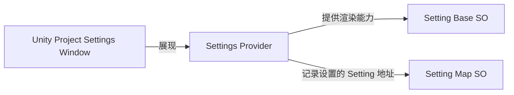
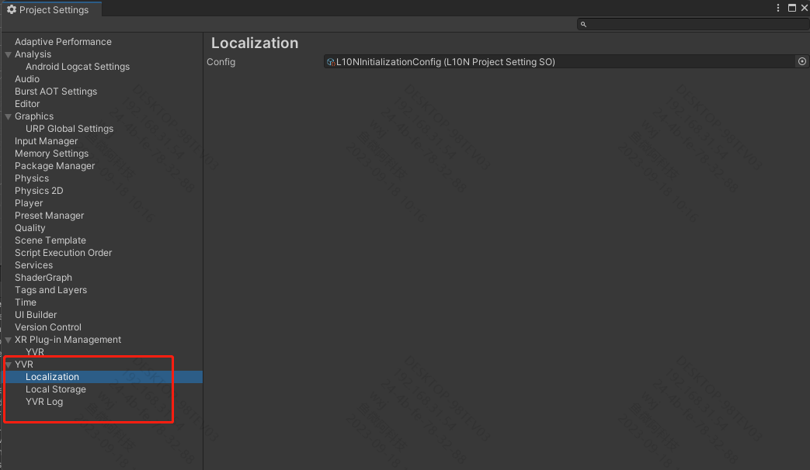
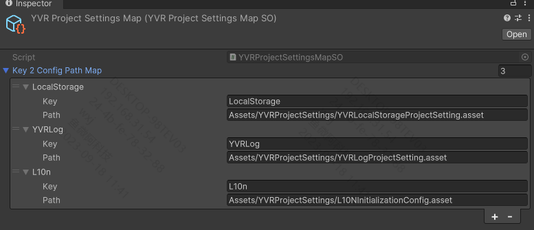

# Project Setting 模块结构

Project Settings 模块由以下三个部分组成：

-   [YVRProjectSettingBaseSO](xref:YVR.Utilities.YVRProjectSettingBaseSO`1)：所有用于进行项目设置的 SO 的基类
-   [YVRProjectSettingProviderBase](xref:YVR.Utilities.YVRProjectSettingProviderBase`1)：用以在 Unity 的 Project Settings 面板中渲染 [YVRProjectSettingBaseSO](xref:YVR.Utilities.YVRProjectSettingBaseSO`1)
-   [YVRProjectSettingsMapSO](xref:YVR.Utilities.YVRProjectSettingsMapSO)：用以记录 Editor 下设定的 Project Settings 与功能内存储的 SO 地址的映射关系。




对于 Project Settings 模块的使用者，需要实现 `YVRProjectSettingBaseSO` 指定实际用以配置的 SO，并且需要实现 `YVRProjectSettingProviderBase` 来提供在 Unity Project Settings 面板中的渲染能力。

最终所有自定义的 Project Settings 都会出现在 Unity Project Settings 面板中，如下图所示：


## YVRProjectSettingBaseSO

[YVRProjectSettingBaseSO](xref:YVR.Utilities.YVRProjectSettingBaseSO`1) 是所有用于进行项目设置的 SO 的基类，各使用 Project Settings 的模块应当在 **Runtime** 目录下定义用于设置项目的 SO 继承该类。

如 LocalStorage 模块需要在项目级别设置本地存储的路径，该路径由 `LocalStorageProjectSettingSO` 设定，`LocalStorageProjectSettingSO`的定义如下：

```csharp
namespace YVR.LocalStorage
{
    [CreateAssetMenu(fileName = "YVRLocalStorageConfig", menuName = "YVR/ProjectSettings/YVRLocalStorage")]
    public class LocalStorageProjectSettingSO : YVRProjectSettingBaseSO<LocalStorageProjectSettingSO>
    {
        [SerializeField] public string localSavePath = "Default";
    }
}
```

`YVRProjectSettingBaseSO` 本质是一个单例，因此可以在运行时可以通过 `YVRProjectSettingBaseSO<T>.Instance` 获取到该单例的实例，如：

```csharp
private static string localPath => LocalStorageProjectSettingSO.instance.localSavePath;
```

由于 Project Settings 模块保证了 `YVRProjectSettingBaseSO` 在程序启动的最早期，就将所有 Project Settings 的 SO 实例化。因此当业务脚本访问 Instance 时，该实例已经创建，不会发生在业务脚本调用时创建 SO 实例的情况。

> [!Warning]
> 如果在运行时出现了 `{typeof(T)} is null, should be set in project settings` 的输出，说明该 `YVRProjectSettingBaseSO` 的实例是在运行时被创建的，属于异常情况。应当检查 Unity Project 面板中是否进行了相应的配置。

## YVRProjectSettingProviderBase

[YVRProjectSettingProviderBase](xref:YVR.Utilities.YVRProjectSettingProviderBase`1) 是用于渲染 [YVRProjectSettingBaseSO](xref:YVR.Utilities.YVRProjectSettingBaseSO`1) 的基类，各使用 Project Settings 的模块应当在 **Editor** 目录下实现该类。

[YVRProjectSettingProviderBase](xref:YVR.Utilities.YVRProjectSettingProviderBase`1) 类派生自 `UnityEditor.SettingsProvider`，因此可以被 Unity Editor 下的 Project Settings 渲染。

对于每一个实现类，应当完成以下三步：

1. 将类的泛型参数指定为该模块用于配置的 SO 类型，如 LocalStorage 模块用于配置的 SO 为 `LocalStorageProjectSettingSO`，因此 `LocalStorageProjectSettingProvider` 的定义如下：
    ```csharp
    public class LocalStorageProjectSettingProvider : YVRProjectSettingProviderBase<LocalStorageProjectSettingSO>
    ```
2. 实现 `settingsKey` 属性，该属性在 `YVRProjectSettingProviderBase` 的内部实现中会用于作为 `YVRProjectSettingsMapSO` 中存储的 Key。因此应当尽可能的保证该 Key 的命名与需要存储的模块强相关，而不是一个通用的 Key。如果出现了 Key 冲突，会导致 Project Settings 模块无法正确的读取到相应的 SO 实例。

    > [!Note]
    > 如果每一个模块都使用了与自身强相关的 Key 命名，但还是发生了冲突，就需要考虑模块的划分是否存在问题

3. 实现被 `SettingsProvider` 标记的静态函数，该函数用于创建 `UnityEditor.SettingsProvider`，以供 Unity Project Settings 面板进行渲染。
   在每个函数中，应当返回自身的实例，并且指派用于控制在 Project Settings Window 中展现标题的 [Label](https://docs.unity3d.com/ScriptReference/SettingsProvider-label.html) 字段，以及用于在 Project Settings Window 中搜索的 [Keywords](https://docs.unity3d.com/ScriptReference/SettingsProvider-keywords.html) 字段。

LocalStorage 模块定义的 `LocalStorageProjectSettingProvider` 如下所示：

```csharp
public class LocalStorageProjectSettingProvider : YVRProjectSettingProviderBase<LocalStorageProjectSettingSO>
{
    public override string settingsKey => "LocalStorage";

    private LocalStorageProjectSettingProvider(string path) : base(path, SettingsScope.Project) { }

    [SettingsProvider]
    public static SettingsProvider CreateLocalStorageConfigSettings()
    {
        var provider = new LocalStorageProjectSettingProvider("Project/YVR/LocalStorage")
        {
            label = "Local Storage",
            keywords = new HashSet<string>(new[] {"YVR", "Local Storage"})
        };

        return provider;
    }
}
```

在 `YVRProjectSettingProviderBase` 中，重写了  `UnityEditor.SettingsProvider` 的 `OnGUI` 函数，并绘制设置 SO 的设置面板。当有新的 SO 被设置时，会通过 `YVRProjectSettingsMapSO` 修改当前工程中的 SO 地址映射关系，保证工程重新打开后，Project Settings 模块能够正确的读取到 SO 实例。

另外，如果新设定的 SO 并不是空对象，该 SO 会被添加至 [PlayerSettings Preload Assets](https://docs.unity3d.com/ScriptReference/PlayerSettings.GetPreloadedAssets.html) 中，Project Settings 模块正是依靠 Preload Assets 实现的在应用启动阶段加载 SO 实例的功能。

> [!Warning]
> 在启动阶段，进行 Resources.Load / Addressables 读取资源会引发程序阻塞（不确定是否是 Unity 2022.3 的 bug）


## YVRProjectSettingsMapSO

> [!Note]
> YVRProjectSettingsMapSO 本身不需要被使用者关心，这一部分会介绍在 Project Settings 内部模块中对其的使用

[YVRProjectSettingsMapSO](xref:YVR.Utilities.YVRProjectSettingsMapSO) 在 `YVRProjectSettingProviderBase` 实现内部中被使用，用于记录 Project Settings 中的 SO 与实际存储的 SO 地址的映射关系（Key 为 `YVRProjectSettingProviderBase.settingsKey`，Value 为 SO 实例在工程中的地址），所有的映射关系都将存储在 `Assets/YVRProjectSettings/YVRProjectSettingsMap.asset` 文件夹下。

> [!Note]
> `Assets/YVRProjectSettings/YVRProjectSettingsMap.asset` 路径是固定的，不可更改

> [!Note]
> 为何将 ProjectSettings 资源存储在 Assets 目录下，而不是工程的 Project Settings 目录下？
> 
> 因为在 `YVRProjectSettingsMapSO` 内部使用 [AssetDatabase](https://docs.unity3d.com/ScriptReference/AssetDatabase.html) 作为资源的存储方式，而 AssetDatabase 只能操作 Assets 目录下的资源。
> 如果找寻到了更好的方式，可以考虑将资源存储在 Project Settings 目录下（或许可以参考 Unity 第一方应用 Packages 的方式）


最终生成的数据如下所示：



# Reference

[Unity Settings Provider](https://docs.unity3d.com/ScriptReference/SettingsProvider.html)
